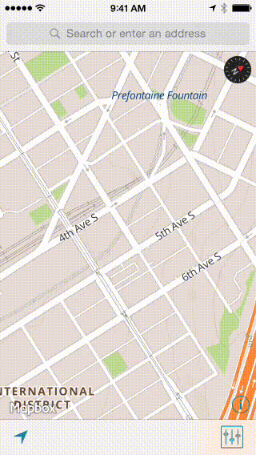

# Fingertips

### Presentation mode for your iOS app

Fingertips is a small library (one class) meant for presentations from iOS devices that shows all touches and gestures so that the audience can see them. 

This is only designed for the iPad 2 and iPhone 4S (or later), which feature [hardware video mirroring](http://www.apple.com/ipad/features/airplay/) support. **This library does not do the mirroring for you!**

Just drop in our replacement `UIWindow` subclass and your app will automatically determine when an external screen is available. It will show every touch on-screen with a nice partially-transparent graphic that automatically fades out when the touch ends. 

If you are using storyboards, the easiest way to integrate Fingertips is to override the `window` method of your application delegate like this:

```objc
// AppDelegate.m

- (UIWindow *)window {
	if (!_window) {
		_window = [[MBFingerTipWindow alloc] initWithFrame:[UIScreen mainScreen].bounds];
	}
	return _window;
}
```

```swift
// AppDelegate.swift (Swift 2)

var window: UIWindow? = MBFingerTipWindow(frame: UIScreen.mainScreen().bounds)
```

```swift
// AppDelegate.swift (Swift 3)

var window: UIWindow? = MBFingerTipWindow(frame: UIScreen.main.bounds)
```

Fingertips requires iOS 5.0 or greater and ARC. It uses **no private API** and is safe for App Store submissions. 



## Configuration

You shouldn't need to configure anything, but if you want to tweak some knobs: 

 * `touchImage`: pass a `UIImage` to use for showing touches
 * `touchAlpha`: change the visible-touch alpha transparency
 * `fadeDuration`: change how long lifted touches fade out
 * `strokeColor`: change default `touchImage` stroke color (defaults to black)
 * `fillColor`: change default `touchImage` fill color (defaults to white)

If you ever need to debug Fingertips, just set the `DEBUG_FINGERTIP_WINDOW` environment variable to `YES` in Xcode or set the runtime property `alwaysShowTouches` to `YES`.

## License

Copyright (c) 2011-2015 Mapbox, Inc.

The Fingertips library should be accompanied by a LICENSE file. This file contains the license relevant to this distribution. If no license exists, please contact [Mapbox](http://mapbox.com).
